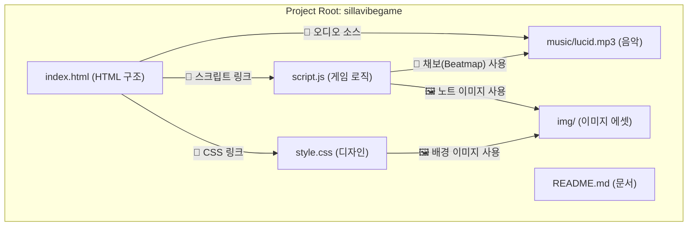

# Silla Vibe Game

Silla Vibe Game은 클래식한 4키 데스크탑 리듬 게임입니다. 음악에 맞춰 떨어지는 노트를 정확한 타이밍에 눌러 높은 점수를 획득하세요.

## 주요 기능

- 음악 동기화 리듬 게임 플레이
- HP 시스템 및 게임 오버
- 점수 랭킹 시스템 (브라우저에 저장되어 유지됨)
- **채보 제작 도우미** 기능 내장
- 커스텀 배경 및 노트 이미지 지원

## 프로젝트 구조

## 게임 방법

1.  **실행**: `https://dpeltms1004-design.github.io/sillavibe-game/` 웹 브라우저에서 엽니다.
2.  **게임 시작**: '게임 시작' 버튼을 누릅니다.
3.  **플레이**: 음악에 맞춰 노트가 화면 하단의 키(A, S, D, F)에 도달하면, 해당하는 키보드 키를 누릅니다.
4.  **게임 정지**: '게임 정지' 버튼을 누르면 언제든지 게임을 멈추고 현재 점수를 랭킹에 기록할 수 있습니다.

*주의: 노트를 놓치면 HP가 감소하며, HP가 0이 되면 게임이 자동으로 종료됩니다.*

## 나만의 채보 만들기

이 게임의 가장 큰 특징은 자신만의 채보(노트 패턴)를 직접 만들 수 있다는 것입니다.

1.  **채보 만들기 모드 시작**: 메인 화면에서 '채보 만들기' 버튼을 클릭합니다.
2.  **패턴 제작**: 게임에 사용된 음악(`lucid.mp3`)이 재생됩니다. 원하는 리듬에 맞춰 A, S, D, F 키를 자유롭게 누릅니다.
3.  **결과 확인**: 음악이 모두 끝나면 "채보 만들기가 완료되었습니다!" 라는 알림이 뜹니다. 키보드의 **F12** 키를 눌러 브라우저의 개발자 도구를 열고 **'Console'** 탭으로 이동하세요. 그곳에 배열 형태의 채보 데이터가 출력되어 있습니다.
4.  **적용**: 콘솔에 출력된 `[...]` 형태의 데이터를 `// --- 복사해서 붙여넣으세요! ---` 아래부터 `// ---------------------------` 위까지 모두 복사합니다.
5.  `c:\sillavibegame\script.js` 파일을 텍스트 편집기(메모장 등)로 엽니다.
6.  파일 상단에 있는 `const beatmap = [...]` 부분을 방금 복사한 데이터로 교체하고 저장합니다.
7.  게임을 새로고침(`F5`)하고 '게임 시작'을 누르면, 당신이 직접 만든 패턴으로 게임을 즐길 수 있습니다.

## 커스터마이징

-   **음악 변경**: 다른 음악을 사용하려면 `c:\sillavibegame\music` 폴더에 음악 파일을 넣고, `index.html`의 `<audio>` 태그와 `script.js`의 `beatmap`을 새롭게 수정해야 합니다. (새로운 음악에는 '채보 만들기' 기능으로 새 채보를 만들어야 합니다.)
-   **노트 이미지 변경**: `c:\sillavibegame\img` 폴더에 있는 이미지들을 교체하여 노트 모양을 바꿀 수 있습니다. (`script.js`의 `imageFiles` 배열도 함께 수정해야 할 수 있습니다.)
-   **배경 이미지 변경**: `style.css` 파일의 `body` 스타일에 있는 `background-image` 속성의 URL을 수정하여 배경을 변경할 수 있습니다.